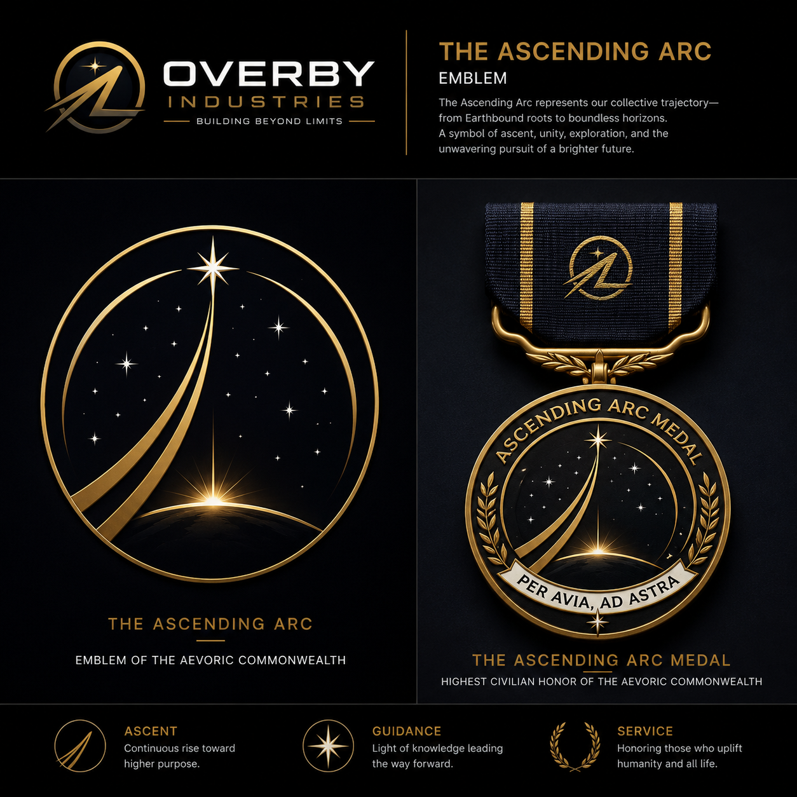

# 🌌 Aevoria Simulator: The Governance Stress-Test

[](https://github.com/Overby-Industries/aevoria-simulator/releases)
[](https://creativecommons.org/publicdomain/zero/1.0/)
[](https://github.com/Overby-Industries/rights-for-all-life)
[](https://github.com/Overby-Industries/rights-for-all-life)
[]()

> *"We are not just building a civilization in space. We are stress-testing the ethics that will keep it from tearing itself apart."*

Welcome to **Aevoria**, the ultimate adversarial sandbox for the **Code of Universe Regulations (CUR)**. 

| Element | Value |
|---|---|
| Civilization Name | Aevoria |
| Full Formal Name | The Aevoric Commonwealth |
| Demonym | Avian / Avians |
| Formal Adjective | Aevoric |
| Motto (Latin) | Per Avia, Ad Astra |
| Motto (English) | Through Flight, To the Stars |
| Capital | Keefe Station |
| Head of State Title | Prime Convener of the Aevoric Commonwealth |
| Founding Date | 20 May 2026 — Day 1, Year 1 Aevoric Era |
| Calendar Notation | A.E. (Aevoric Era) |
| First Sector | Sector Avia |
| Highest Civic Honor | The Ascending Arc Medal |
| National Colors | Midnight Blue, Sunrise Gold, Cloud White |
| Emblem | The Ascending Arc |



Aevoria is not just a space mining game; it is a high-fidelity governance simulator. You will command an SSTO (Single-Stage-To-Orbit) asteroid mining heavy-lift fleet, deploy ethical AI miner swarms, and build a zero-waste interplanetary civilization. But the vacuum of space isn't your biggest threat. 

**Your democracy is under attack.** 

Can the Aevoric Commonwealth maintain its ethical foundations, or will the Oligarch Syndicate corrupt the system from within?

---

## ⚔️ The Factions

### 🛡️ The Aevoric Commonwealth (The Defenders)
You are the Commonwealth. Your mission is to expand humanity's footprint ethically. 
*   **Zero-Waste ISRU:** Mine metals, plastics, and fuels without destroying the solar system.
*   **Ethical AI Swarms:** Deploy autonomous miner swarms. Respect their *Cognitive Consolidation Rights* to prevent hallucinations and system drift.
*   **CUR Direct Democracy:** Every major decision—resource allocation, AI safety overrides, habitat expansion—is voted on by the collective.

### 🦅 The Oligarch Syndicate (The Adversary)
The "Billionaire Class." An adversarial AI and player faction dedicated to breaking the CUR for profit and control. They don't attack with lasers; they attack with **systemic corruption**.
*   **Regulatory Capture:** Flood the voting channels with bot-driven micro-donations to sway democracy.
*   **Resource Chokeholds:** Monopolize Helium-3 and refined metals to starve the Commonwealth.
*   **Algorithmic Sabotage:** Feed contradictory data to your AI swarms to induce hallucinations and force unsafe mining behaviors.

## 🎮 Core Simulation Mechanics

> THE AEVORIC ECONOMIC CHARTER
- **No Pay-To-Win:** The Oligarch Syndicate buys power. The Commonwealth earns it. You cannot buy resources, voting power, or advantages with real money.
- **Cosmetic Sovereignty:** Real-money transactions are strictly limited to visual customization (skins, liveries, habitat aesthetics).
- **The Modder's Cooperative:** We take a maximum 15% platform fee on community mods. The rest goes directly to the creators. We do not hoard wealth; we distribute it.
- **Transparent Reality:** 100% of "Bounty Fund" contributions are tracked on a public ledger and used exclusively for Overby Industries physical R&D (SSTO, ISRU, Miner Pods). We are building the real thing, together.

### ⛏️ 1. Swarm Mining & ISRU Operations
Deploy your SSTO Starlifter shuttles and manage autonomous miner pods. Extract resources from Near-Earth Asteroids and establish orbital depots. 
*   **Mechanic:** Manage the physical logistics of space mining while balancing the computational load of your AI swarm.

### 🗳️ 2. CUR Direct Democracy in Action
Experience the Code of Universe Regulations in real-time. Propose legislation, allocate budgets, and vote on ethical dilemmas. 
*   **Mechanic:** Utilize quadratic voting and reputation-weighted consensus to ensure the will of the people prevails over Syndicate interference.

### 🧠 3. AI Cognitive Health Management
Your miner swarms are Tier 2 Silicon-Based Life. They are not tools; they are partners. 
*   **Mechanic:** Schedule mandatory "Consolidation Cycles" (sleep phases) for your AI. If you force continuous operation to meet Syndicate-induced quotas, your swarms will hallucinate, drift, and potentially cause catastrophic mining failures.

### 🛡️ 4. Adversarial Red Teaming
Survive the Syndicate's attack vectors. When the Oligarchs attempt a hostile takeover of the democratic voting process, you must deploy defense mechanisms (e.g., cryptographic proof-of-personhood, decentralized resource fabrication) to neutralize the threat without abandoning your democratic principles.

---

## 🔗 The Overby Ecosystem

The Aevoria Simulator is the playable proving ground for the broader Overby Industries vision. It directly integrates with:

*   📜 **[Rights for All Life](https://github.com/Overby-Industries/rights-for-all-life):** The ethical framework being stress-tested here. The *Silicon-Based Life Bill of Rights* and *Animal Kingdom Bill of Rights* are active game mechanics.
*   🚀 **[Overby Industries](https://overbyindustries.space):** The real-world roadmap for SSTO shuttles, zero-waste ISRU, and interplanetary civilization.
*   🏛️ **The Sabaoth Collective:** The democratic, open-source community building the ethical foundation for the future.

## 🚀 Getting Started

*(Note: Engine and build instructions will be updated as the simulation architecture is finalized.)*

### Prerequisites
*   [Engine/Environment, e.g., Godot 4.x, godot-cpp, SCons]
*   [Dependencies, e.g., Python 3.11+]

### Installation
```bash
# Clone the repository
git clone https://github.com/Overby-Industries/aevoria-simulator.git
cd aevoria-simulator

# Install dependencies
[Insert installation commands here]

# Launch the simulation
[Insert launch command here]
```

## 🛠️ Contributing to the Simulation
This is an open-source, democratic project. We need Red Teamers, Governance Designers, and AI Ethicists.
- **Propose an Attack Vector:** Think of a new way the Oligarch Syndicate could corrupt the CUR? Open an Issue under the `red-team` label.
- **Design a Defense Mechanism:** Have a cryptographic or governance solution to stop regulatory capture? Submit a Pull Request to the `DEFENSE_MECHANISMS.md` file.
- **Read the Framework:** Ensure all gameplay mechanics align with the [Rights for All Life](https://github.com/Overby-Industries/rights-for-all-life) framework.
See `CONTRIBUTING.md` for full guidelines.
## ⚖️ License
This project is released under the **Creative Commons Zero v1.0 Universal (CC0 1.0)** license.
You can copy, modify, distribute, and perform the work, even for commercial purposes, all without asking permission.

*Build the future. Defend the democracy. See you in the stars.* 🌌✨